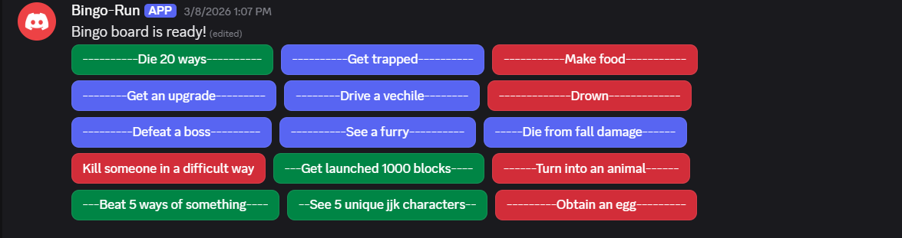

# Bingo-Run


A Discord bot that generates interactive bingo boards for multiplayer challenge runs. Players configure a custom list of challenges, set a board size, and assign teammates — the bot then posts an interactive button grid in the server channel where each player can mark off challenges in their own color.

> This project was built to practice Python while learning the Discord API (discord.py).

---

## How the Game Works

1. A host runs `!new_game` in a server channel to start a session.
2. The bot DMs the host to collect configuration:
   - Board size (up to 5x5)
   - A list of challenges (one per cell)
   - Player Discord IDs and their assigned color
3. Once configured, the host runs `!start` in the DM and the bot posts the bingo board back into the server channel as an interactive button grid.
4. Players click buttons to claim challenges — each button toggles to that player's assigned color.
5. The board stays active for 12 hours, then times out automatically.
6. Run `!end_game` in the server to clear the session early.

### What the Board Looks Like



Each cell is a Discord button labeled with a challenge. Buttons turn green, red, or blurple depending on which player claimed it.

---

## Commands

### Server Commands
| Command | Description |
|---|---|
| `!new_game` | Starts a new game session and opens a DM for configuration |
| `!end_game` | Ends the current game session |
| `!info` | Explains how the bot works |
| `!commands` | Lists all available commands |

### DM Commands (sent after `!new_game`)
| Command | Example | Description |
|---|---|---|
| `!board_size <w> <h>` | `!board_size 3 5` | Sets the board dimensions (max 5x5) |
| `!challenges <list>` | `!challenges eat pizza, win a race, find a secret` | Comma-separated list of challenges |
| `!players <list>` | `!players 123456789 green, 987654321 red` | Player Discord IDs and their color |
| `!load` | *(attach a .csv file)* | Load all config at once from a CSV file |
| `!start` | | Posts the board to the server channel |
| `!colors` | | Lists valid colors: `red`, `green`, `blurple` |

### CSV Format (for `!load`)

```
board, 3, 5
players, 123456789012345678 green, 876543210987654321 red
challenges, challenge1, challenge2, challenge3, ...
```

See `test.csv` in this repo for a working example.

---

## Running It Locally

### Prerequisites

- Python 3.11+
- A Discord bot token ([create one here](https://discord.com/developers/applications))
- The bot must be invited to your server with the `bot` scope and `Send Messages`, `Read Messages` permissions

### Setup

1. **Clone the repo**
   ```bash
   git clone <repo-url>
   cd Bingo-Run
   ```

2. **Install dependencies**
   ```bash
   pip install discord.py python-dotenv
   ```

3. **Create a `.env` file** in the project root:
   ```
   DISCORD_TOKEN=your_bot_token_here
   ```

4. **Run the bot**
   ```bash
   python main.py
   ```

The bot will print `Hello world` on startup and log to `discord.log`.

> **Nix users:** A `flake.nix` and `.envrc` are included. Run `direnv allow` to drop into the dev shell automatically.

---

## Limitations Found

Discord's UI components have some hard constraints that were a hurdle during development:

- **No button sizing** — Discord buttons are all the same fixed size. There is no way to make a button wider or taller to better fit longer challenge names.
- **Alignment issues** — Because all buttons are the same size but challenge labels are different lengths, the grid never looks truly aligned. The code works around this by padding labels with dashes to approximate centering, but it is a workaround for a platform limitation, not a real fix.
- **Five buttons per row max** — Discord enforces a hard cap of 5 buttons per row, which limits board dimensions and layout flexibility.

---

## Next Steps

The Discord button grid is a fun proof of concept but runs into a ceiling quickly. The two most natural next steps are:

- **Raylib app** — A native desktop app using ralib would give full control over rendering: variable button sizes, real text centering, custom colors, and no platform restrictions.
- **Web app** — A browser-based version (e.g. using a simple HTML/CSS/JS frontend or a framework like React) would be cross-platform, easy to share, and could support features like a live scoreboard, persistence, and mobile play.
